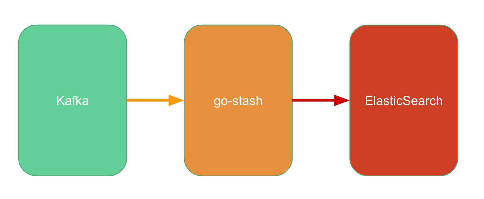

English | [简体中文](readme-cn.md)

# go-stash

go-stash is a high performance, free and open source server-side data processing pipeline that ingests data from Kafka, processes it, and then sends it to ElasticSearch. 

go-stash is about 5x throughput more than logstash, and easy to deploy, only one executable file.



## Quick Start

### Install

```shell
cd stash && go build stash.go
```

### Quick Start

```shell
. /stash -f etc/config.yaml
```

The config.yaml example is as follows:

```yaml
Clusters:
- Input:
    Kafka:
      Name: go-stash
      Log:
        Mode: file
      Brokers:
      - "172.16.48.41:9092"
      - "172.16.48.42:9092"
      - "172.16.48.43:9092"
      Topic: ngapplog
      Group: stash
      Conns: 3
      Consumers: 10
      Processors: 60
      MinBytes: 1048576
      MaxBytes: 10485760
      Offset: first
  Filters:
  - Action: drop
    Conditions:
      - Key: status
        Value: 503
        Type: contains
      - Key: type
        Value: "app"
        Type: match
        Op: and
  - Action: remove_field
    Fields:
    - message
    - source
    - beat
    - fields
    - input_type
    - offset
    - "@version"
    - _score
    - _type
    - clientip
    - http_host
    - request_time
  Output:
    ElasticSearch:
      Hosts:
      - "http://172.16.188.73:9200"
      - "http://172.16.188.74:9200"
      - "http://172.16.188.75:9200"
      Index: "go-stash-{{yyyy.MM.dd}}"
      MaxChunkBytes: 5242880
      GracePeriod: 10s
      Compress: false
      TimeZone: UTC
```

## Details

### input

```yaml
Conns: 3
Consumers: 10
Processors: 60
MinBytes: 1048576
MaxBytes: 10485760
Offset: first
```
#### Conns
* The number of links to kafka, the number of links is based on the number of cores of the CPU, usually <= the number of cores of the CPU.

#### Consumers
* The number of open threads per connection, the calculation rule is Conns * Consumers, not recommended to exceed the total number of slices, for example, if the topic slice is 30, Conns * Consumers <= 30

#### Processors
* The number of threads to process data, depending on the number of CPU cores, can be increased appropriately, the recommended configuration: Conns * Consumers * 2 or Conns * Consumers * 3, for example: 60 or 90

#### MinBytes MaxBytes
* The default size of the data block from kafka is 1M~10M. If the network and IO are better, you can adjust it higher.

#### Offset
* Optional last and false, the default is last, which means read data from kafka from the beginning


### Filters

```yaml
- Action: drop
  Conditions:
    - Key: k8s_container_name
      Value: "-rpc"
      Type: contains
    - Key: level
      Value: info
      Type: match
      Op: and
- Action: remove_field
  Fields:
    - message
    - _source
    - _type
    - _score
    - _id
    - "@version"
    - topic
    - index
    - beat
    - docker_container
    - offset
    - prospector
    - source
    - stream
- Action: transfer
  Field: message
  Target: data
```

#### - Action: drop
  - Delete flag: The data that meets this condition will be removed when processing and will not be entered into es
  - According to the delete condition, specify the value of the key field and Value, the Type field can be contains (contains) or match (match)
  - Splice condition Op: and, can also write or

#### - Action: remove_field
  Remove_field_id: the field to be removed, just list it below

#### - Action: transfer
  Transfer field identifier: for example, the message field can be redefined as a data field


### Output

#### Index
* Index name, indexname-{{yyyy.MM.dd}} for year. Month. Day, or {{yyyy-MM-dd}}, in your own format

#### MaxChunkBytes
* The size of the bulk submitted to ES each time, default is 5M, can be adjusted according to the ES io situation.

#### GracePeriod
* The default is 10s, which is used to process the remaining consumption and data within 10s after the program closes and exits gracefully

#### Compress
* Data compression, compression will reduce the amount of data transferred, but will increase certain processing performance, optional value true/false, default is false

#### TimeZone
* Default value is UTC, Universal Standard Time

## ES performance write test


### Test environment
- stash server: 3 units 4 cores 8G
- es server: 15 units 16 cores 64G

### Key configuration

```yaml
- Input:
      Conns: 3
      Consumers: 10
      Processors: 60
      MinBytes: 1048576
      MaxBytes: 10485760
  Filters:
  - Action: remove_field
    Fields:
    - Message
    - source
    - beat
    - fields
    - input_type
    - offset
    - request_time
  Output:
      Index: "nginx_pro-{{yyyy.MM.d}}"
      Compress: false
      MaxChunkBytes: 5242880
      TimeZone: UTC
```

### Write speed is above 150k/s on average


## Acknowledgements

go-stash is powered by [**go-zero**](https://github.com/zeromicro/go-zero)   for great performance!

## Give a Star! ⭐

If you like or are using this project to learn or start your solution, please give it a star. Thanks!
